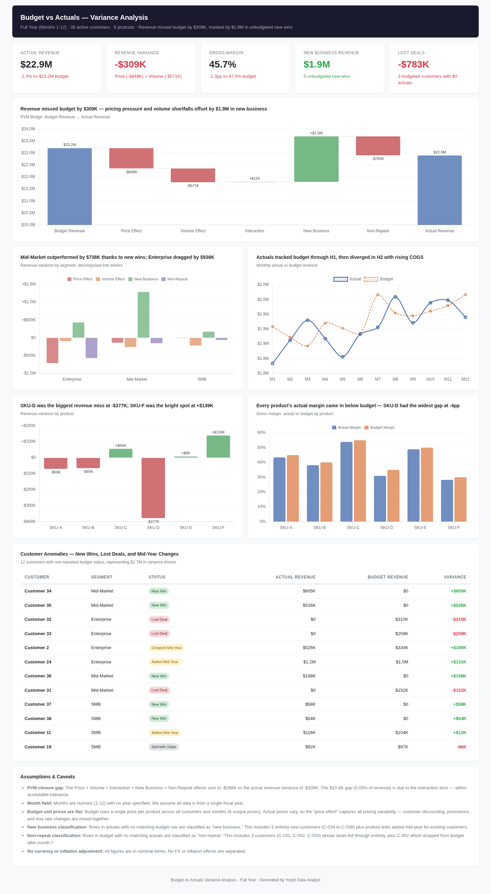
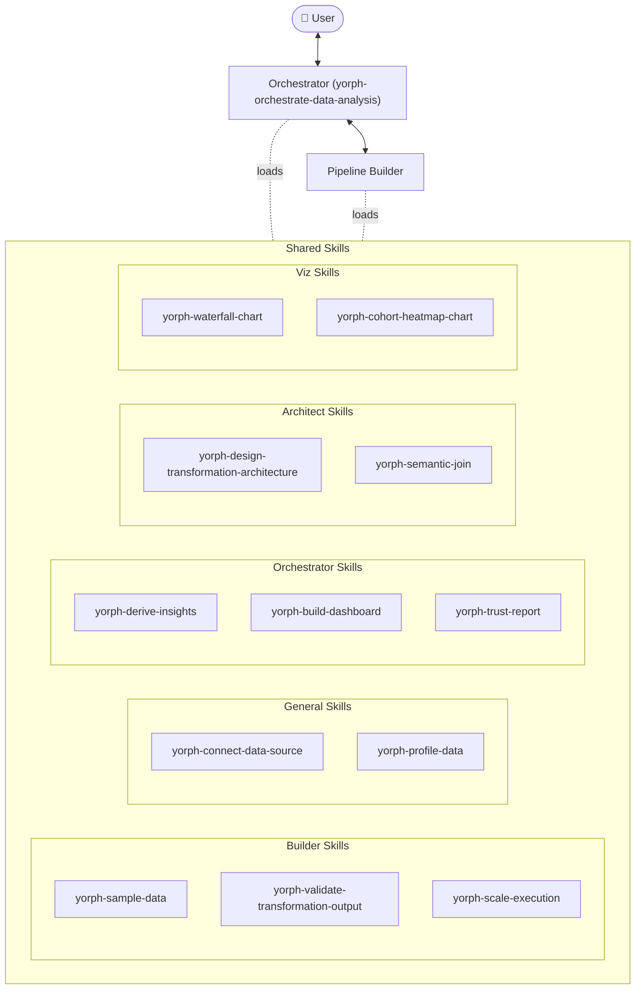

# Yorph Data Expert Marketplace

A Claude Code plugin marketplace focused on data expertise — starting with the Yorph Data Analyst.

---

## Plugin

| Plugin | Description |
|---|---|
| [yorph-data-analyst](./plugins/yorph-data-analyst) | Describe what you want to know in plain English; two agents handle the rest — one plans and communicates, one writes and runs the transformation pipeline — no SQL required |

---

## Installation

### Option A — GitHub marketplace

In Claude Code: **Customize → Browse Plugins → Personal → + → Add Marketplace from GitHub** → enter `https://github.com/YorphAI/yorph-data-expert-marketplace` → install **yorph-data-analyst**.

### Option B — Upload a zip

Download [`yorph-data-analyst.zip`](./plugins/yorph-data-analyst/yorph-data-analyst.zip), then in Claude Code: **Customize → + next to Personal Plugins → upload zip**.

---

## Description

Yorph Data Analyst transforms raw, messy data into deep, executive-ready insights — no technical expertise or hand-holding required. Upload files or connect your data warehouse and just ask. Under the hood it runs a full data engineering pipeline: profiling your data, designing a transformation architecture, building and validating the pipeline, then delivering ranked findings, interactive visualizations, and a trust report that documents every assumption made — so your results are shareable and auditable.

Built for business users who need more than surface-level analysis: root cause, attribution, cohort, and variance analysis on real-world imperfect data. When your engineers need to verify or extend the work, the pipeline is fully transparent and ready for handoff.

**Supports:** CSV, Excel, JSON, XML, plain text, and connected data warehouses (Snowflake, BigQuery, Supabase, and more).

---

## Example use cases

**Revenue anomaly you can't explain** — Sales numbers came in wrong for the quarter. You have exports from three systems with overlapping records, inconsistent category names, and missing values. Drop them in and get a root cause breakdown you can present to the CFO.

**Quarterly financial attribution** — You need to explain what drove the change in a key metric — revenue, margin, or cost — from one quarter to the next. Get a waterfall chart breaking down the contribution of each factor (price, volume, mix, FX, one-offs) with the analysis behind it.

**A dataset your team has been avoiding** — Eighteen months of operational data across multiple files, messy joins, unclear definitions. The analysis everyone keeps deprioritizing because it's too complex to set up manually. Just ask for insights.

**Results that need to hold up to scrutiny** — You're going into a board meeting or regulatory review. You need to know not just what the data says but what assumptions were made, what was imputed, and what the caveats are before anyone asks.

**A one-off analysis that keeps getting handed around** — The business user pulls a warehouse export, passes it to an analyst, who reruns it manually every month. Let the pipeline be built once, documented, and handed off cleanly.

---

## What you get

- Cleaned, transformed data ready for downstream use
- Charts and a summary dashboard
- A **trust report** — what the pipeline did, what it assumed, and where to double-check

---

## How it works

Two agents share a library of skills. The Orchestrator is the only one you talk to — it plans, gets your sign-off, delegates execution to the Pipeline Builder, and delivers results. The Pipeline Builder runs invisibly: it builds, validates, and scales the transformation, then hands results back.

### Skills

| Group | Skills |
|---|---|
| **Orchestrator** | `yorph-derive-insights`, `yorph-build-dashboard`, `yorph-trust-report` |
| **Architect** | `yorph-design-transformation-architecture`, `yorph-semantic-join` |
| **Builder** | `yorph-sample-data`, `yorph-validate-transformation-output`, `yorph-scale-execution` |
| **General** | `yorph-connect-data-source`, `yorph-profile-data` |
| **Viz** | `yorph-waterfall-chart`, `yorph-cohort-heatmap-chart` |

---

## Unique skill: semantic join

**[Semantic Join Demo →](https://htmlpreview.github.io/?https://raw.githubusercontent.com/YorphAI/yorph-data-expert-marketplace/main/showcase/yorph-data-analyst/examples/semantic-join-demo.html)**

See how `yorph-semantic-join` resolves the problem of messy and inconsistent text data on the fly.

---

## Contributing

Issues and PRs welcome.
